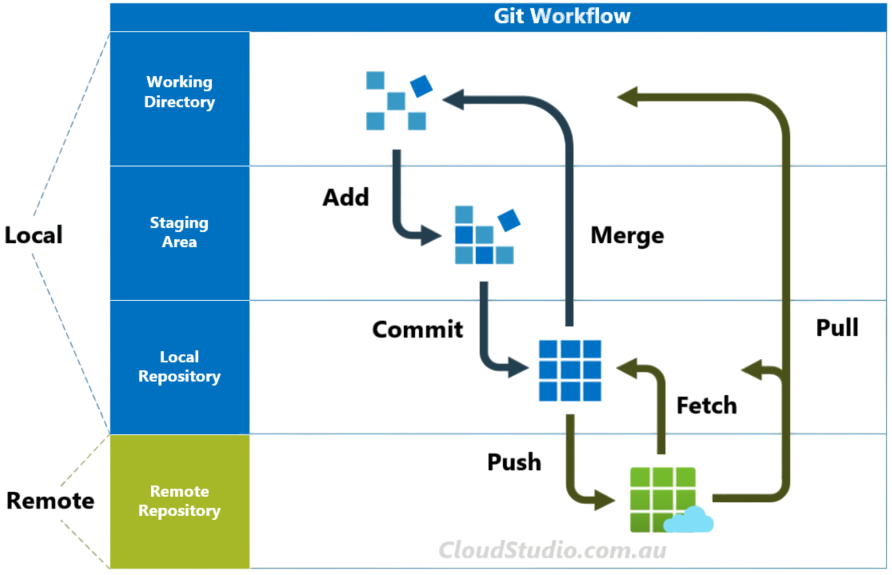

# GitScesi 2026

En este proyecto, aprenderé Git utilizando el repositorio como apuntes de clase.

<p align="center">
    
</p>

 ## Autor
**Franco Prieto Ayala**

 <a href="https://github.com/Francopaa" target="_blank">***Francopaa***</a>

 ## Clase 1  
 
 ### Que es GIT?
 
 Es un **MVC**: Model Version Control 

#### ¿Qué es un sistema de control de versiones?

Es una herramienta que te ayuda a realizar un seguimiento de los cambios en los archivos a lo largo del tiempo. Te permite revertir a versiones anteriores, colaborar con otros y gestionar diferentes versiones de tu código.

### Como nacio GIT?
* **1990**: Surgieron las primeras herramientas de control de versiones como RCS y CVS.

* **2005**: <a href="https://en.wikipedia.org/wiki/Linus_Torvalds" target="_blank"> Linus Torvalds creó Git para el desarrollo del kernel de Linux.

* **2008**: Se lanzó GitHub, impulsando la adopción de Git. Inicialmente se creó con Ruby.

* **2018**: Microsoft adquirió GitHub, ampliando aún más su alcance.

* **2025**: GitHub lidera el mercado con funciones basadas en IA y herramientas de colaboración avanzadas.

### Como instalar GIT?

1. Ir a <a href="https://git-scm.com/install/" target="_blank"> **https://git-scm.com/install/**
2. Seguir los pasos de instalación recomendados para tu S.O. 
3. Verificar la correcta instalacion con **`git --version`**

### Configuracion basicas 

<p align="center">
  <table>
    <tr>
      <th>Comando</th>
      <th>Descripción</th>
    </tr>
    <tr>
      <td><code>git config --global user.name "Tu Nombre"</code></td>
      <td>Configura GIT con tu nombre</td>
    </tr>
    <tr>
      <td><code>git config --global user.email "tu@correo.com"</code></td>
      <td>Configura GIT con tu correo</td>
    </tr>
    <tr>
      <td><code>git config --global core.autocrlf true/code></td>
      <td>anejar automáticamente los finales de línea en archivos de texto</td>
    </tr>
  </table>
</p>

## Clase 2

### STATES Y COMMITS
En Git, un estado se refiere al estado de tus archivos en el proceso de control de versiones.


* **Modified** : El archivo ha sido creado, modificado o eliminado, pero aún no se ha preparado para su confirmación.
* **Staged** : El archivo está marcado para ser incluido en la próxima confirmación.
* **Commited** : Los cambios se guardan en el repositorio local.

<p align="center">
    
</p>

#### ¿Como hacer que el archivo que modifique vuelva a su estado original?

*`git restore <archivo>`**   borra físicamente el archivo modificado a su estado original

#### Git Add

Una vez que sepas qué archivos quieres incluir en tu commit, debes prepararlos usando el comando `git add`. Por ejemplo:

<table align="center">
  <tr>
    <th>Comando</th>
    <th>Descripción</th>
  </tr>
  <tr>
    <td><code>git add &lt;file&gt;</code></td>
    <td>Preparar un archivo específico</td>
  </tr>
  <tr>
    <td><code>git add .</code></td>
    <td>Preparar todos los archivos modificados</td>
  </tr>
</table>

**Tip :** Usa `git restore staged <file>` para quitar de stage.

#### Git Commit

Un commit es una snapshot de los cambios de tu proyecto en un momento específico. Funciona como un punto de guardado, lo que te permite realizar un seguimiento de los cambios y revertirlos si es necesario.

Cada commit contiene un identificador único, una descripción de los cambios realizados y detalles adicionales como el autor y la hora en que se realizó el commit.

<p align="center"><strong>En palabras cortas es un checkpoint en los videjuegos.</strong></p>
 
<p align="center">
    
</p>

### Como hacer un commit?

Después de preparar los archivos, puedes crear una confirmación usando el comando `git commit`. Por ejemplo:

<p align="center">
  <table>
    <tr>
      <th>Comando</th>
      <th>Descripción</th>
    </tr>
    <tr>
      <td><code>git commit</code></td>
      <td>Agrega el mensaje de confirmación en tu IDE.</td>
    </tr>
    <tr>
      <td><code>git commit -m "El mensaje de tu commit"</code></td>
      <td>Agregar mensaje de confirmación directamente</td>
    </tr>
    <tr>
      <td><code>git commit --amend</code></td>
      <td>Modificar el último mensaje de confirmación o incluir nuevos cambios preparados.</td>
    </tr>
  </table>
</p>

Es importante tener en cuenta que estos cambios se guardarán en su repositorio local. A partir de ahora, para deshacerlos, deberá revertirlos creando una nueva confirmación en el historial de cambios del repositorio.

<p align="center">
    
</p>

#### ¿Cómo puedo dejar de rastrear un archivo?

Crea un archivo `.gitignore` en tu proyecto y agrega los siguientes patrones para indicarle a Git qué archivos o carpetas debe ignorar:

<table align="center">
  <thead>
    <tr>
      <th>Descripción</th>
      <th>Patron en .gitignore</th>
    </tr>
  </thead>
  <tbody>
    <tr>
      <td>Ignorar todos los archivos <code>.log</code></td>
      <td><code>*.log</code></td>
    </tr>
    <tr>
      <td>Ignorar la carpeta <code>node_modules</code></td>
      <td><code>node_modules/</code></td>
    </tr>
    <tr>
      <td>Ignorar un archivo especifico</td>
      <td><code>secrets.env</code></td>
    </tr>
  </tbody>
</table>

#### Buenas practicas 

* Es un estándar seguido por la mayoría de los equipos de desarrollo.
* Resolver conflictos o problemas durante el desarrollo se vuelve más sencillo.
* El historial de commits es más legible.

##### ¿Con qué frecuencia hacer commits?
 
* Es mejor hacer commits pequeños, agrupando mejoras o acciones puntuales, que hacer un commit grande con todo lo que se quiere hacer.
* Hacer commits frecuentes no significa hacerlos sin propósito.

##### Cómo escribir buenos commits
 
* Usa verbos como: Add (Añadir), Change (Cambiar), Fix (Corregir) o Remove (Eliminar).
* No uses "." ni "..."; en el peor caso, usa ",".
* Usa un máximo de 50 caracteres para tu commit.
* Añade todo el contexto necesario.
* Usa prefijos para hacerlos más semánticos.

##### Prefijos para commits
 
* **feat**: para una nueva funcionalidad para el usuario.
* **fix**: para un bug que afecta al usuario.
* **perf**: para cambios que mejoran el rendimiento del sitio.
* **build**: para cambios en el sistema de construcción, despliegue o tareas de instalación.
* **ci**: para cambios en la integración continua.
* **docs**: para cambios en la documentación.
* **refactor**: para refactorización de código, como renombrar variables o funciones.

### Cuarta clase

#### GitHub

<p align="center">
  
</p>

##### Que es GitHub?

GitHub es una plataforma web para el control de versiones y la colaboración, basada en Git. Permite a los desarrolladores alojar, gestionar y compartir sus repositorios de código, a la vez que proporciona herramientas para la colaboración, el seguimiento de incidencias y la gestión de proyectos.

#### Como crear un repositorio en GitHub?

Crear un repositorio en GitHub es un proceso sencillo. Sigue estos pasos:

1. **Inicia sesión en GitHub**  
   Ve a [GitHub](https://github.com/) e inicia sesión con tus credenciales.

2. **Navega a la página de Nuevo Repositorio**  
   Haz clic en el ícono `+` en la esquina superior derecha de la página y selecciona **New repository**.

3. **Completa los detalles del repositorio**  
   - **Repository Name**: Ingresa un nombre único para tu repositorio.
   - **Description** (opcional): Agrega una breve descripción de tu proyecto.
   - **Visibility**: Elige entre **Public** (visible para todos) o **Private** (solo accesible para ti y tus colaboradores).

4. **Inicializa el repositorio**  
   - Opcionalmente, marca la casilla para **Add a README file**. Este archivo se usa comúnmente para describir tu proyecto.
   - También puedes agregar un archivo `.gitignore` para especificar qué archivos Git debe ignorar.
   - Opcionalmente, elige una licencia para tu proyecto.

5. **Crea el repositorio**  
   Haz clic en el botón **Create repository** para finalizar.

6. **Clona el repositorio**  
   Después de crear el repositorio, puedes clonarlo en tu máquina local usando el comando:

   ```bash
   git clone <repository-url>

#### Conexión por SSH con GitHub

1. **Abre tu terminal**  
   En tu sistema operativo, abre la terminal o consola de comandos.

2. **Verifica si tienes una clave SSH existente**  
   Usa el siguiente comando para comprobar si ya tienes claves SSH generadas:

   ```bash
   ls ~/.ssh
   ```

   Si ves archivos como `id_rsa` e `id_rsa.pub` o `id_ed25519` e `id_ed25519.pub`, ya tienes una clave SSH.

3. **Genera una nueva clave SSH (si no tienes una)**  
   Ejecuta el siguiente comando reemplazando `tu_correo@example.com` por tu correo de GitHub:

   ```bash
   ssh-keygen -t ed25519 -C "tu_correo@example.com"
   ```

   Si tu sistema no soporta `ed25519`, puedes usar:

   ```bash
   ssh-keygen -t rsa -b 4096 -C "tu_correo@example.com"
   ```

4. **Inicia el agente SSH**  
   Ejecuta el siguiente comando para iniciar el agente SSH:

   ```bash
   eval "$(ssh-agent -s)"
   ```

5. **Agrega tu clave SSH al agente**  
   Usa el siguiente comando para añadir tu clave privada:

   ```bash
   ssh-add ~/.ssh/id_ed25519
   ```

   O si usaste RSA:

   ```bash
   ssh-add ~/.ssh/id_rsa
   ```

6. **Copia la clave pública**  
   Muestra el contenido de tu clave pública con:

   ```bash
   cat ~/.ssh/id_ed25519.pub
   ```

   Copia todo el contenido que aparece en pantalla.

7. **Agrega la clave SSH a GitHub**  
   - Ve a GitHub e inicia sesión.
   - Entra en **Settings**.
   - Selecciona **SSH and GPG keys**.
   - Haz clic en **New SSH key**.
   - Asigna un título a tu clave.
   - Pega la clave pública copiada anteriormente.
   - Haz clic en **Add SSH key**.

8. **Prueba la conexión SSH**  
   Ejecuta el siguiente comando para verificar que todo funciona correctamente:

   ```bash
   ssh -T git@github.com
   ```

   Si todo está bien configurado, verás un mensaje de bienvenida de GitHub.

#### GitHub: Repositorio Nuevo o Existente

##### Caso 1: Crear un repositorio nuevo en GitHub

1. **Inicia sesión en GitHub**  
   Ve a https://github.com/ e inicia sesión con tus credenciales.

2. **Navega a la página de Nuevo Repositorio**  
   Haz clic en el ícono `+` en la esquina superior derecha y selecciona **New repository**.

3. **Completa los detalles del repositorio**  
   - **Repository Name**: Ingresa un nombre único.
   - **Description** (opcional): Agrega una breve descripción.
   - **Visibility**: Elige entre **Public** o **Private**.

4. **Inicializa el repositorio**  
   - Opcionalmente marca **Add a README file**.
   - Puedes agregar un archivo `.gitignore`.
   - También puedes elegir una licencia.

5. **Crea el repositorio**  
   Haz clic en **Create repository**.

6. **Clona el repositorio**  
   Usa el siguiente comando:

   ```bash
   git clone <repository-url>
   ```

---

#### Caso 2: Conectar un proyecto local a un repositorio existente

1. **Abre tu terminal**  
   Ubícate dentro de la carpeta de tu proyecto local:

   ```bash
   cd ruta/de/tu/proyecto
   ```

2. **Inicializa Git (si aún no está inicializado)**

   ```bash
   git init
   ```

3. **Agrega los archivos al repositorio local**

   ```bash
   git add .
   ```

4. **Realiza el primer commit**

   ```bash
   git commit -m "Primer commit"
   ```

5. **Conecta tu proyecto con el repositorio remoto existente**

   ```bash
   git remote add origin <repository-url>
   ```

6. **Verifica la rama principal**  
   Si deseas usar `main`:

   ```bash
   git branch -M main
   ```

7. **Envía el proyecto a GitHub**

   ```bash
   git push -u origin main
   ```

8. **Verifica en GitHub**  
   Entra a tu repositorio y confirma que los archivos se hayan subido correctamente.

### Quinta clase

#### ¿Cómo ir y volver de un commit?

1. **Ver el historial de commits**

```bash
git log --oneline
```

Esto mostrará una lista resumida de commits con su identificador.

2. **Moverse a un commit anterior**

```bash
git checkout <id-del-commit>
```

Esto te llevará temporalmente a ese commit.

3. **Volver a la rama principal**

```bash
git checkout main
```

O si usas `master`:

```bash
git checkout master
```

4. **Regresar definitivamente a un commit**

```bash
git reset --hard <id-del-commit>
```

⚠️ Este comando elimina cambios posteriores.

#### Pull

1. **Actualizar tu repositorio local con cambios remotos**

```bash
git pull origin main
```

2. **¿Qué hace este comando?**

- Descarga los cambios del repositorio remoto
- Los fusiona automáticamente con tu rama actual

3. **Si usas otra rama**

```bash
git pull origin develop
```

#### "Detached HEAD"

1. **¿Qué significa?**

Ocurre cuando haces:

```bash
git checkout <id-del-commit>
```

Git te mueve a un commit específico, pero no estás dentro de una rama.

2. **¿Qué pasa aquí?**

- Puedes revisar archivos antiguos
- Puedes probar cambios
- Pero si haces commits aquí, no estarán en una rama normal

3. **Cómo salir de Detached HEAD**

```bash
git checkout main
```

4. **Guardar cambios desde Detached HEAD**

```bash
git checkout -b nueva-rama
```

Esto crea una nueva rama desde ese punto.